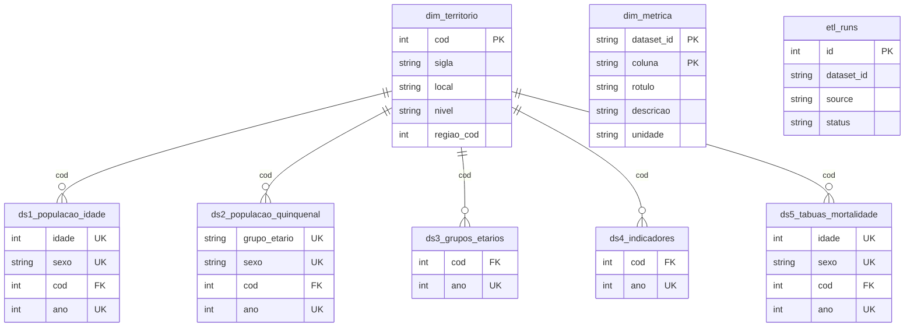

# DER da camada ouro

`cod` nas cinco tabelas fato referencia `dim_territorio.cod`. `regiao_cod` não tem FK.

```mermaid
erDiagram
    dim_territorio {
        int cod PK
        string sigla
        string local
        string nivel
        int regiao_cod
    }
    dim_metrica {
        string dataset_id PK
        string coluna PK
        string rotulo
        string descricao
        string unidade
    }
    etl_runs {
        int id PK
        string dataset_id
        string source
        string status
    }
    ds1_populacao_idade {
        int idade UK
        string sexo UK
        int cod FK
        int ano UK
    }
    ds2_populacao_quinquenal {
        string grupo_etario UK
        string sexo UK
        int cod FK
        int ano UK
    }
    ds3_grupos_etarios {
        int cod FK
        int ano UK
    }
    ds4_indicadores {
        int cod FK
        int ano UK
    }
    ds5_tabuas_mortalidade {
        int idade UK
        string sexo UK
        int cod FK
        int ano UK
    }
    dim_territorio ||--o{ ds1_populacao_idade : cod
    dim_territorio ||--o{ ds2_populacao_quinquenal : cod
    dim_territorio ||--o{ ds3_grupos_etarios : cod
    dim_territorio ||--o{ ds4_indicadores : cod
    dim_territorio ||--o{ ds5_tabuas_mortalidade : cod
```
